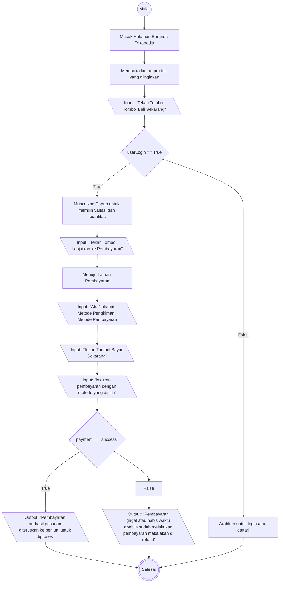

# Algorithma Checkout Tokopedia

## Algorithma Descriptive

1. Mulai
2. membuka laman produk yang diinginkan
3. tekan tombol beli sekarang
4. pastikan pengguna sudah login
5. jika ya munculkan popup untuk masukan variasi dan kuantitas produk yang diinginkan kemudian konfirmasi untuk masuk laman pembayaran 
6. jika tidak arahkan ke laman login
7. pilih alamat
8. pilih metode pengiriman
9. pilih metode pembayaran
11. konfirmasi pembelian dengan klik tombol bayar sekarang
10. lakukan pembayaran dengan metode yang dipilih
11. jika pembayaran berhasil maka pesanan diteruskan ke penjual untuk dikirim
12. jika pembayaran tidak berhasil maka kirim notifikasi pembelian gagal dan lakukan refund
13. Selesai

## Flowchart Checkout Tokopedia
