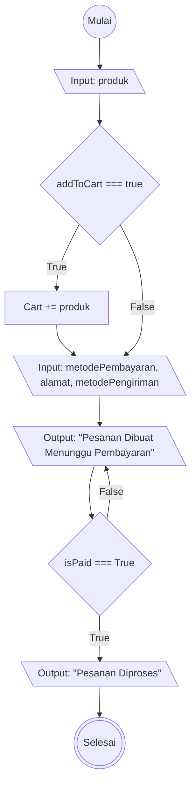

# Algorithma Checkout Tokopedia

## Algorithma Descriptive

1. Mulai
2. Pilih produk
3. Jika ingin Masukan produk ke keranjang jika ingin membeli banyak produk berbeda
4. jika tidak masuk ke laman form pembayaran 
5. atur alamat penerima
6. pilih metode pengiriman
7. pilih metode pembayaran
8. lakukan pembayaran
9. setelah pembayaran pesanan akan diproses
10. Selesai

## Flowchart Checkout Tokopedia
