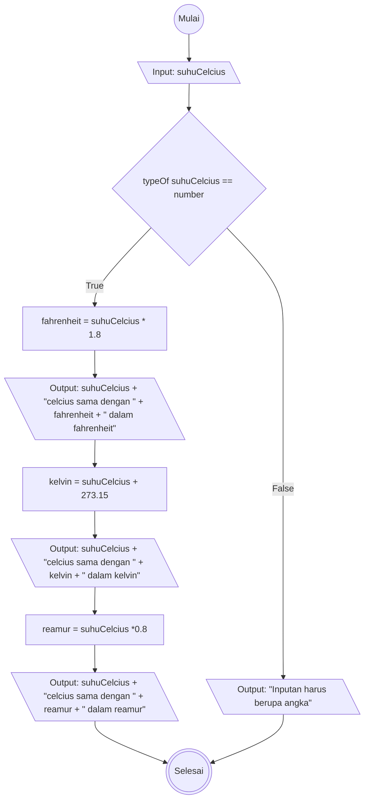

# Algorithma Program Konversi Suhu

## Algorithma Descriptive

1. Mulai
2. Masukan angka suhu dalam satuan celcius
3. Konversi angka suhu ke fahrenheit dengan rumus angka suhu dikali sembilan per lima kemudian hasilnya ditambah dengan tiga puluh dua kemudian tampilkan hasilnya
4. konversi angka suhu ke kelvin dengan rumus angka suhu ditambah dua ratus tujuh puluh tiga koma lima belas kemudian tampilkan hasilnya
5. konversi angka suhu ke reamur dengan rumus angka suhu dikali empat per lima kemudian tampilkan hasilnya
6. Selesai

