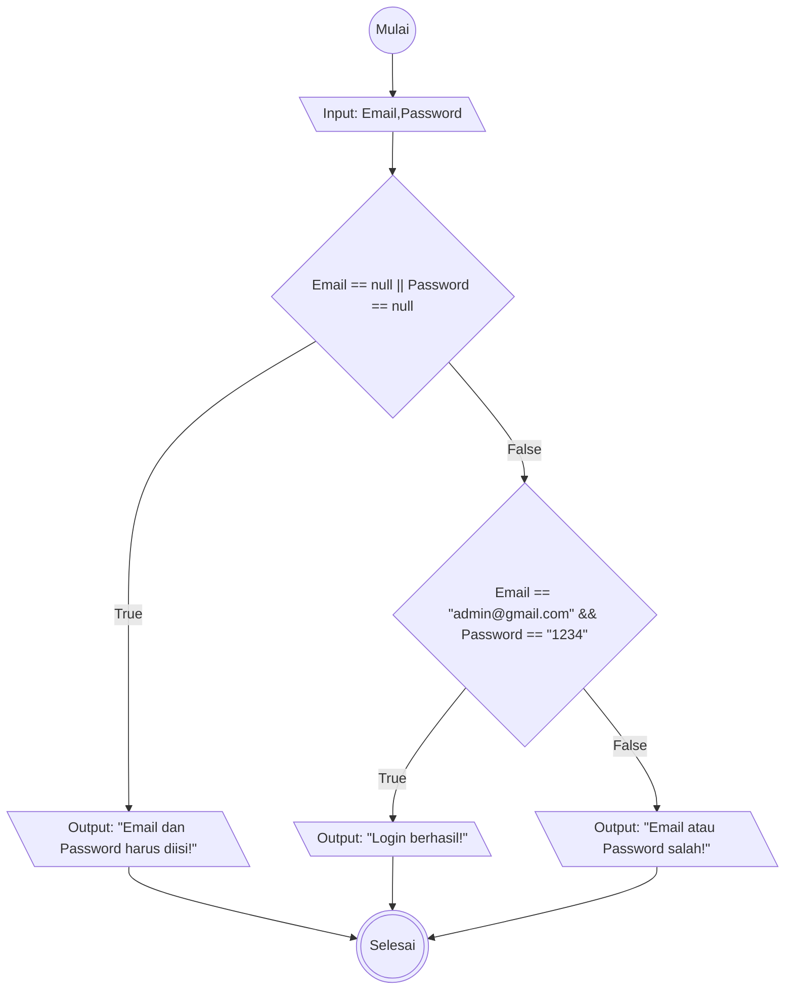

```mermaid
flowchart TD

start@{"shape": "circle", "label": "Mulai"}
b@{"shape": "lean-l", "label": "Input: Email,Password"}
c@{"shape": "diamond", "label": "Email == null || Password == null"}
d@{"shape": "lean-l", "label": "Output: #quot;Email dan Password harus diisi!#quot;"}
e@{"shape": "diamond", "label": "Email == #quot;admin@gmail.com#quot; && Password == #quot;1234#quot;"}
f@{"shape": "lean-l", "label": "Output: #quot;Login berhasil!#quot;"}
g@{"shape": "lean-l", "label": "Output: #quot;Email atau Password salah!#quot;"}

h@{"shape": "dbl-circ", "label": "Selesai"}

start-->b-->c--True-->d-->h
c--False-->e--True-->f-->h
e--False-->g-->h

```