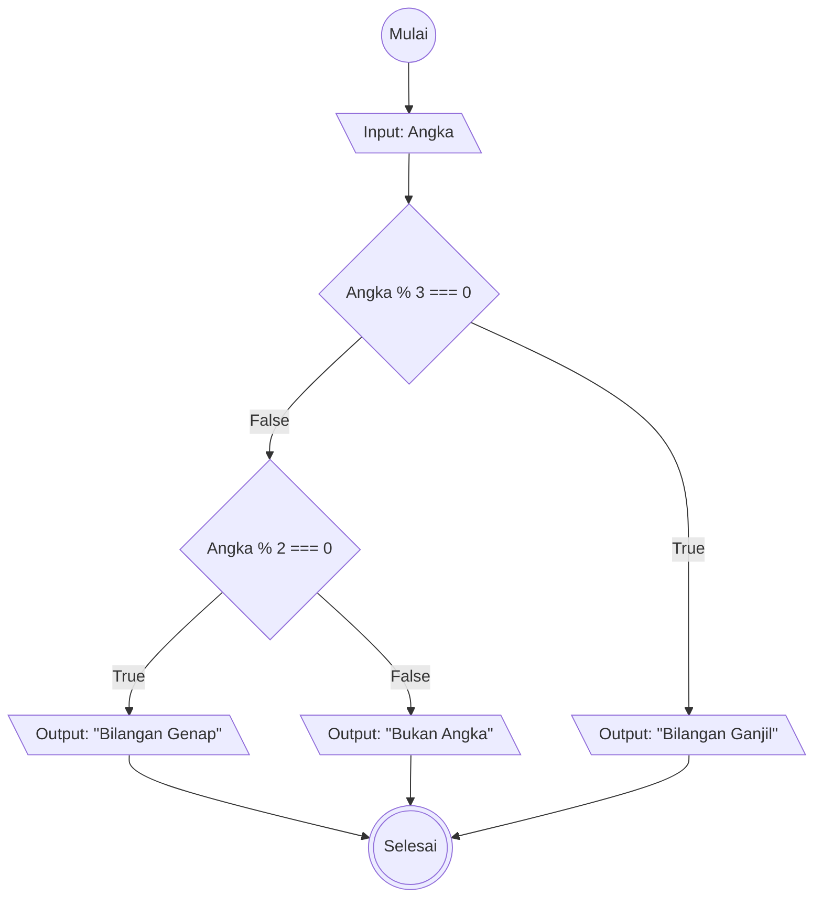

```mermaid
flowchart TD

start@{"shape":"circle",  "label": "Mulai"}
b@{"shape":"lean-l",  "label": "Input: Angka"}
c@{"shape":"diamond",  "label": "Angka % 3 === 0"}
d@{"shape":"lean-l",  "label": "Output: #quot;Bilangan Ganjil#quot;"}
e@{"shape":"diamond",  "label": "Angka % 2 === 0"}
f@{"shape":"lean-l",  "label": "Output: #quot;Bilangan Genap#quot;"}
g@{"shape":"lean-l",  "label": "Output: #quot;Bukan Angka#quot;"}
h@{"shape":"dbl-circ",  "label": "Selesai"}

start-->b-->c--False-->e--True-->f-->h
c--True-->d-->h
e--False-->g-->h
```