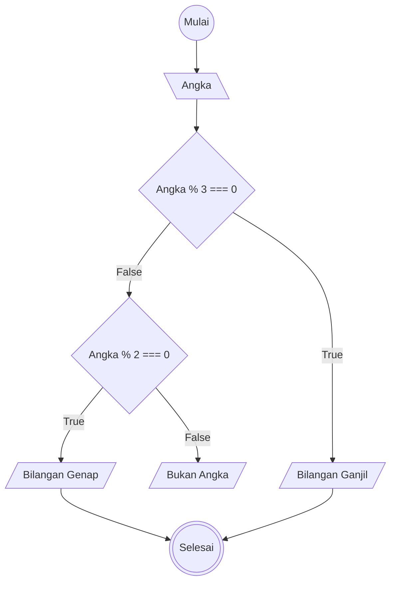

```mermaid
flowchart TD

a@{"shape":"circle",  "label": "Mulai"}
b@{"shape":"lean-l",  "label": "Angka"}
c@{"shape":"diamond",  "label": "Angka % 3 === 0"}
d@{"shape":"lean-r",  "label": "Bilangan Ganjil"}
e@{"shape":"diamond",  "label": "Angka % 2 === 0"}
f@{"shape":"lean-r",  "label": "Bilangan Genap"}
g@{"shape":"lean-r",  "label": "Bukan Angka"}
h@{"shape":"dbl-circ",  "label": "Selesai"}

a-->b-->c--False-->e--True-->f-->h
c--True-->d-->h
e--False-->g
```