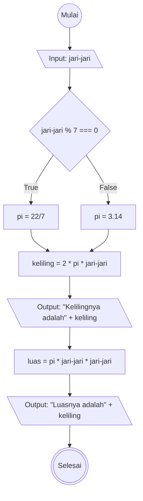

```mermaid
flowchart TD

start@{"shape":"circle",  "label": "Mulai"}
a@{"shape":"lean-l",  "label": "Input: jari-jari"}
b@{"shape":"diamond",  "label": "jari-jari % 7 === 0"}
c@{"shape":"rectangle",  "label": "pi = 22/7"}
d@{"shape":"rectangle",  "label": "pi = 3.14"}
e@{"shape":"rectangle",  "label": "keliling = 2 * pi * jari-jari"}
f@{"shape":"lean-l",  "label": "Output: #quot;Kelilingnya adalah#quot; + keliling"}
g@{"shape":"rectangle",  "label": "luas = pi * jari-jari * jari-jari"}
h@{"shape":"lean-l",  "label": "Output: #quot;Luasnya adalah#quot; + keliling"}

i@{"shape":"dbl-circ",  "label": "Selesai"}

start-->a-->b
b--True-->c
b--False-->d
c-->e
d-->e
e-->f-->g-->h-->i

```